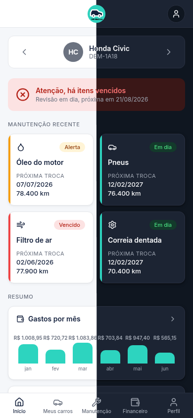
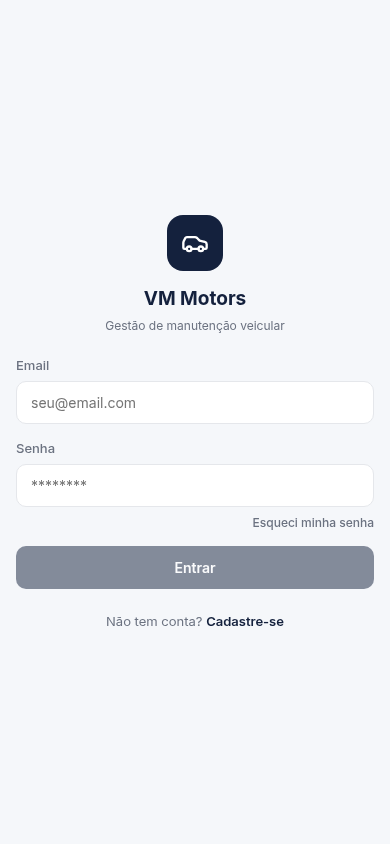
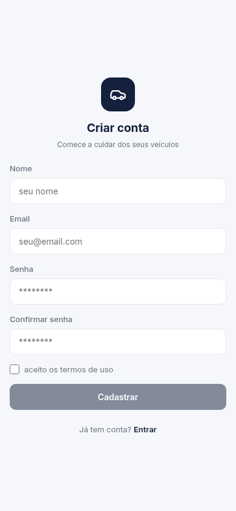
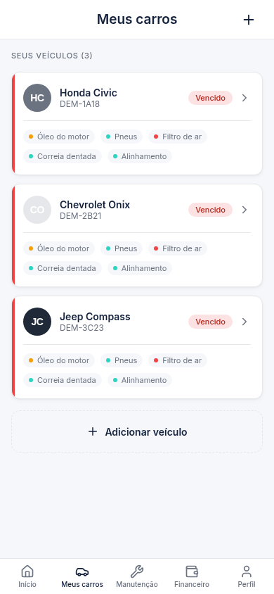
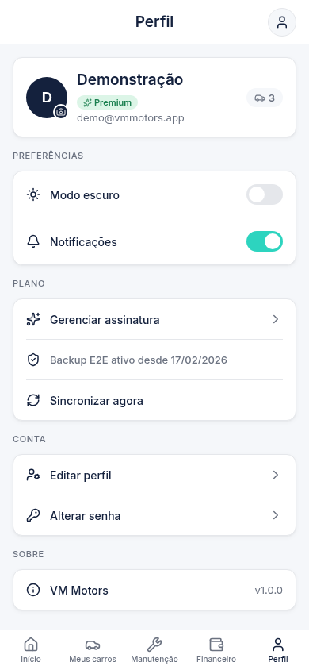

# VM Motors

## Informações Institucionais

- **Disciplina:** Experiência Criativa: Inovando Colaborativamente
- **Instituição:** Pontifícia Universidade Católica do Paraná
- **Professores:** Glauco Vinicius de Franca Furstenberger & Mateus Nunes da Silva
- **Turma:** U
- **Equipe:** 10 (MMGV)

### Membros da equipe

| Nome Completo | Usuário GitHub |
| :--- | :--- |
| `Gustavo Tasca Lazzari` | `@GLazzari1428` |
| `Mateus Roese Tucunduva` | `@Matizuuu` |
| `Matheus Yamamoto Dias` | `@MatheusYamas` |
| `Victor Ryuki Tamezava` | `@VicRuk` |

---

## 1. Sobre o Projeto

VM Motors é um app pra acompanhar a manutenção dos seus carros, feito pra rodar no celular. Cada carro cadastrado mostra os itens de manutenção (óleo, pneus, filtro, correia e outros) com status de em dia, alerta ou vencido. Tem também um módulo financeiro pra registrar gastos por categoria e ver o histórico. O backend é uma API própria em Node.js, com autenticação JWT e banco MySQL.

---

## 2. Funcionalidades

Telas disponíveis no app:

- **Início:** visão geral do carro selecionado, com status dos itens de manutenção.
- **Meus Carros:** lista de carros cadastrados, com opção de adicionar e editar.
- **Manutenção:** itens monitorados por carro, data da última troca e próxima prevista.
- **Financeiro:** gastos por categoria (manutenção, combustível, seguro, etc.), resumo mensal e gráfico dos últimos 6 meses.
- **Perfil:** edição de dados pessoais, troca de senha e alternância de tema claro/escuro.
- **Autenticação:** cadastro, login e recuperação de senha por e-mail.

---

## 3. Tecnologias

| Camada | Tecnologia |
| :--- | :--- |
| Frontend | React, Vite, React Router, Zustand, Lucide React |
| Backend | Node.js, Express |
| Banco de dados | MySQL / MariaDB |
| Autenticação | JWT (jsonwebtoken), bcryptjs |
| Estilização | CSS Modules |

---

## 4. Telas

<table>
  <tr>
    <td valign="middle">
      
    </td>
    <td>
      <table>
        <tr>
          <td align="center"><b>Login</b><br/></td>
          <td align="center"><b>Cadastro</b><br/></td>
          <td align="center"><b>Início</b><br/></td>
        </tr>
        <tr>
          <td align="center"><b>Meus Carros</b><br/></td>
          <td align="center"><b>Perfil do Carro</b><br/></td>
          <td align="center"><b>Manutenção</b><br/></td>
        </tr>
        <tr>
          <td align="center"><b>Financeiro</b><br/></td>
          <td align="center"><b>Perfil</b><br/></td>
          <td align="center"><b>Assinatura</b><br/></td>
        </tr>
      </table>
    </td>
  </tr>
</table>

---

## 5. Estrutura do Repositório

```
mmgv/
├── db/                  # Scripts SQL (schema e seeds)
├── server/              # API REST (Node.js + Express)
│   └── src/
│       ├── config/      # Conexão com banco e variáveis de ambiente
│       ├── controllers/ # Lógica de cada rota
│       ├── middleware/  # Autenticação, validação e erros
│       ├── routes/      # Definição das rotas
│       ├── utils/       # Helpers (formato de data, JWT, erros HTTP)
│       └── validators/  # Schemas de validação de entrada
└── src/                 # Frontend (React + Vite)
    ├── components/
    │   ├── common/      # Componentes reutilizáveis (Button, Card, Modal)
    │   ├── layout/      # Header, BottomNav, AppShell
    │   └── features/    # Componentes específicos de cada tela
    ├── pages/           # Uma pasta por rota
    ├── routes/          # Configuração de rotas e rota protegida
    ├── services/        # Chamadas à API
    ├── store/           # Estado global (Zustand)
    └── utils/           # Funções utilitárias
```

---

## 6. Como Executar

**Pré-requisitos:** Node.js 18+, Docker (para o banco de dados).

1. **Clonar o repositório**

   ```bash
   git clone https://github.com/GLazzari1428/mmgv.git
   cd mmgv
   ```

2. **Instalar dependências do frontend**

   ```bash
   npm install
   ```

3. **Instalar dependências do backend**

   ```bash
   cd server && npm install && cd ..
   ```

4. **Configurar variáveis de ambiente**

   ```bash
   cp server/.env.example server/.env
   # editar server/.env com as credenciais locais
   ```

5. **Subir o banco de dados**

   ```bash
   docker run -d --network host --name mmgv-db \
     -e MYSQL_ROOT_PASSWORD=root \
     -e MYSQL_DATABASE=vmmotors \
     mysql:8
   ```

6. **Inicializar o schema e seeds**

   ```bash
   node server/scripts/initdb.js
   ```

7. **Rodar o backend**

   ```bash
   cd server && npm run dev
   # sobe em http://127.0.0.1:3001
   ```

8. **Rodar o frontend** (novo terminal)

   ```bash
   npm run dev
   # sobe em http://127.0.0.1:3000
   ```

---

## 7. Convençao Git
O fluxo é `feature/* → develop → main`. Cada funcionalidade ou correção ganha sua própria branch a partir de develop, e o merge sempre vai via pull request com `--no-ff`. Push direto no develop ou no main não é permitido.

Já o padrão dos commits é `tipo_de_commit: mensagem curta`. Tipos usados:

| Tipo | Quando usar |
| :--- | :--- |
| `feat` | nova funcionalidade |
| `fix` | correção de bug |
| `chore` | configurações, seeds, tarefas de infra |
| `refactor` | mudança de código sem alterar comportamento |
| `style` | formatação e renomeações visuais |
| `docs` | documentação |

Exemplos: `feat: tela de login`, `fix: validacao de token expirado`, `chore: dados iniciais de manutencao`.